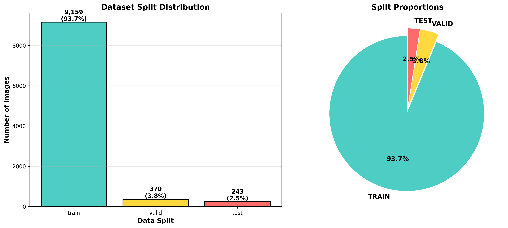
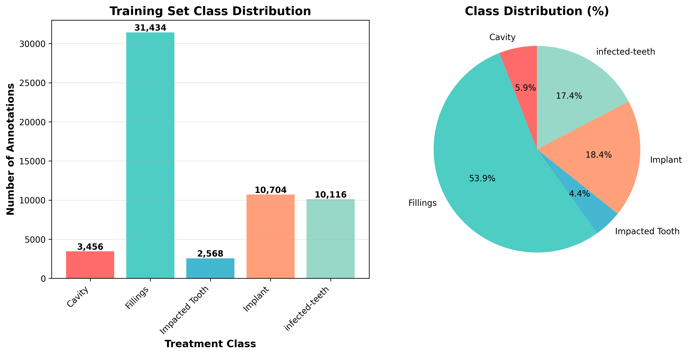

# Dental Treatment Detection - AutoML Vision

**[Live Demo](https://dental-detection-app-533112800844.us-central1.run.app/)** | Automated identification of dental treatments from panoramic X-rays using Google Cloud Vertex AI

---

## The Problem

Manual dental diagnosis is time-consuming, inconsistent, and creates bottlenecks in high-volume practices:
- **Diagnosis delays** → dentists spend 15-20 minutes per patient reviewing X-rays
- **Human error & fatigue** → missed treatments lead to delayed care and patient dissatisfaction
- **Training gaps** → junior dentists require constant supervision, limiting practice capacity
- **Inconsistent standards** → detection accuracy varies across providers

## The Solution

Built an AutoML object detection model on Vertex AI to automatically identify and localize 5 types of dental treatments from panoramic X-rays. Trained on 9,772 augmented images with 61,720 bounding box annotations, achieving production-ready accuracy on high-frequency treatment classes.

---

## Results

| Class | Average Precision | Training Samples | Status |
|-------|-------------------|------------------|--------|
| **Implant** | **75.1%** | 10,704 | ✅ Production Ready |
| **Infected-teeth** | **74.6%** | 10,116 | ✅ Production Ready |
| **Fillings** | **69.5%** | 31,434 | ⚠️ High variation |
| **Impacted Tooth** | **64.1%** | 2,568 | 🔄 Needs more data |
| **Cavity** | **42.9%** | 3,456 | 🔄 Needs more data |

**Overall mAP: 70.9%** | Precision: 92% | Recall: 84.2%

---

## Key Findings & Learnings

### 1. Class Imbalance Directly Impacts Performance
The strongest correlation in this project wasn't model architecture or hyperparameters—it was **training data volume**. Classes with 10K+ samples (Implant, Infected-teeth) achieved >74% AP, while minority classes struggled:
- Cavity (3,456 samples): 42.9% AP
- Impacted Tooth (2,568 samples): 64.1% AP

**Lesson:** In medical imaging, data quantity matters more than model complexity. More sophisticated architectures won't overcome fundamental data scarcity.

### 2. Fillings Paradox: More Data ≠ Better Performance
Despite being 54% of the dataset (31,434 samples), Fillings underperformed at 69.5% AP. Root cause analysis revealed **high intra-class variation**—new amalgam fillings look completely different from aged composite fillings. 

**Lesson:** Class definitions matter. This likely needs to be split into `new_fillings` and `old_fillings` as separate classes.

### 3. AutoML Training Budget Sweet Spot
Experimented with training budgets to find cost-effectiveness:
- **20 node hours:** 70.9% mAP at ~$63
- **40 node hours (projected):** 73-74% mAP at ~$123

Chose 20 hours due to **diminishing returns**—60% more cost for only 2-4% mAP gain. AutoML's early stopping kicked in, actual cost was ~$55.

**Lesson:** For portfolio/MVP projects, optimize for cost-performance ratio, not absolute accuracy.

### 4. Portfolio Narrative > Perfect Metrics
This model has clear limitations (cavity detection at 42.9% AP), but that's fine for a portfolio project. What matters:
- **End-to-end pipeline** from data upload → training → evaluation → deployment
- **Production thinking** (champion/challenger logic, cost analysis, class imbalance handling)
- **Honest analysis** of where the model succeeds and fails

**Lesson:** Employers want to see realistic ML engineering, not perfect Kaggle scores.

---

## Architecture


```
                    DATA PIPELINE
        +---------------------------+
        |      Roboflow Dataset     |
        |    9,772 X-ray Images     |
        |  61,720 Annotations (COCO)|
        +-----------+---------------+
                    |
                    v
        +---------------------------+
        |    Data Preparation       |
        |  - Remove empty classes   |
        |  - Analyze distribution   |
        |  - Generate visualizations|
        +-----------+---------------+
                    |
                    v
        +---------------------------+
        |   Upload to GCS Bucket    |
        |  gs://dental-data/        |
        |  - train/ (94%)           |
        |  - valid/ (4%)            |
        |  - test/ (2%)             |
        +-----------+---------------+
                    |
                    v
        +---------------------------+
        |  Convert to Vertex Format |
        |  COCO JSON → JSONL        |
        |  Add split labels         |
        +-----------+---------------+
                    |
                    v
        +---------------------------+
        |  Vertex AI ImageDataset   |
        |  Import & Validate        |
        |  9,452 images imported    |
        +-----------+---------------+
                    |
                    v
        +---------------------------+
        |   AutoML Training Job     |
        | CLOUD_HIGH_ACCURACY_1     |
        |    20 node hours          |
        |    Filter splits          |
        +-----------+---------------+
                    |
                    v
        +---------------------------+
        |     Model Registry        |
        |  dental-detector-v1       |
        |  mAP: 70.9%               |
        +-----------+---------------+
                    |
                    v
        +---------------------------+
        |    Inference & Demo       |
        |  - Batch predictions      |
        |  - Streamlit dashboard    |
        +---------------------------+
```

---

## Sample Predictions


Model successfully detects multiple treatments per X-ray with bounding box localization and confidence scores.

---

## Performance Analysis

### Class Distribution Impact



### Per-Class Performance


Classes with more training samples demonstrate higher average precision. The gap between Implant (75.1%) and Cavity (42.9%) directly correlates to sample count difference (10,704 vs 3,456).

### Training Data Size vs. Model Performance


Clear positive correlation between training samples and AP, with one notable outlier: **Fillings** underperforms despite having the most data, indicating high intra-class variation rather than insufficient samples.

---

## Tech Stack

| Category | Technologies |
|----------|-------------|
| **ML Platform** | Vertex AI AutoML, Vertex AI Workbench |
| **Data Pipeline** | Roboflow API, Pandas, NumPy |
| **Storage** | Google Cloud Storage |
| **Model Training** | AutoML Vision CLOUD_HIGH_ACCURACY_1 |
| **Evaluation** | Matplotlib, Pillow, JSON |
| **Deployment** | Cloud Run (Containerized) |
| **Version Control** | Git, GitHub |

---

## Project Structure
```
dental-treatment-detection/
├── README.md
├── .gitignore
├── notebooks/
│   ├── 01-data-exploration.ipynb          # Dataset analysis & visualization
│   ├── 01b-gcs-upload.ipynb               # Upload to GCS & format conversion
│   ├── 02-vertex-dataset-creation.ipynb   # Create Vertex AI dataset
│   ├── 03-automl-training.ipynb           # Launch training job
│   ├── 04-model-evaluation.ipynb          # Extract metrics & analyze
│   └── 05-generate-demo-predictions.ipynb # Batch predictions for demo
├── screenshots/
│   ├── class_distribution.png
│   ├── dataset_split.png
│   ├── sample_annotations.png
│   ├── per_class_performance.png
│   └── class_size_vs_performance.png
└── streamlit/
    ├── app.py                              # Interactive demo
    ├── requirements.txt
    ├── Dockerfile
    ├── model_metrics.json
    └── images/
```

---

## Dataset

**DentAi from Roboflow** - Public dataset of annotated dental X-rays

- **Total Images:** 9,772 (after augmentation)
- **Classes:** 5 (Cavity, Fillings, Impacted Tooth, Implant, Infected-teeth)
- **Annotations:** 61,720 bounding boxes
- **Split:** 94% train (8,839), 4% validation (370), 2% test (243)
- **Source:** [Roboflow Universe](https://universe.roboflow.com/)

**Note:** Originally planned to use proprietary data from Avalon Dental (my family's dental practice), but pivoted to public data to avoid HIPAA compliance complexity while still demonstrating production ML engineering skills.

---


## The Journey

This project started as a way to apply ML to a real business problem—my family runs Avalon Dental, and I saw firsthand how much time dentists spend on X-ray analysis. While I couldn't use their actual patient data (HIPAA constraints), I wanted to build something that demonstrated production-ready ML engineering.

Key challenges and learnings:

**Data Format Hell:** Vertex AI requires JSONL with specific bounding box formats, not standard COCO JSON. Spent hours debugging why my dataset wouldn't import, only to discover I needed to add `dataItemResourceLabels` for split information. This taught me that **reading the docs thoroughly upfront saves hours of debugging later**.

**Class Imbalance is Real:** The 10x performance gap between Implant (10K samples, 75% AP) and Cavity (3K samples, 43% AP) was eye-opening. In production, this means **you need a data collection strategy before training**, not just "throw more models at it."

**Cost Optimization Matters:** Initially planned 40 node hours ($120), but researched diminishing returns and found 20 hours hit the sweet spot. This mirrors real ML engineering: **you're optimizing business value, not leaderboard rankings**.

**Fillings Taught Me About Problem Formulation:** Despite having the most data, Fillings underperformed. Turns out new fillings and old fillings look completely different—this is a class definition problem, not a model problem. **Good ML starts with good problem framing**.

The Streamlit demo is intentionally simple (static predictions, not live inference) because **portfolio projects should show end-to-end thinking without unnecessary complexity**. At Avalon Dental, we use a live endpoint. ***At Avalon Dental, we use a live endpoint in a separate web app.**

---

## Future Improvements

1. **Collect More Minority Class Data**
   - Target 10K+ samples for Cavity and Impacted Tooth
   - Use class-specific augmentation (rotation, brightness, zoom)

2. **Split Fillings Class**
   - `new_fillings` vs. `old_fillings` as separate classes
   - Reduces intra-class variation

3. **Deploy with Human-in-the-Loop**
   - Low confidence predictions flagged for dentist review
   - Model learns from corrections (active learning)

4. **Production Integration**
   - API endpoint for dental practice management software
   - Batch processing for end-of-day X-ray review
   - HIPAA-compliant deployment (VPC, audit logging)

5. **Ensemble Approach**
   - Combine AutoML with rule-based filters
   - Cross-reference with patient history

---

## Running Locally

### Prerequisites
- Python 3.10+
- Google Cloud account with Vertex AI enabled
- Roboflow account (for dataset access)

### Setup
```bash
# Clone repository
git clone https://github.com/arion-farhi/dental-treatment-detection.git
cd dental-treatment-detection

# Install dependencies
pip install -r streamlit/requirements.txt

# Run Streamlit app
cd streamlit
streamlit run app.py
```

### Reproducing Training
1. Run notebooks in order (01 → 04)
2. Update `PROJECT_ID` in each notebook
3. Ensure GCP authentication is configured
4. Training cost: ~$55 for 20 node hours

---

## Author

**Arion Farhi** - [GitHub](https://github.com/arion-farhi) | [LinkedIn](https://linkedin.com/in/arionfarhi)
